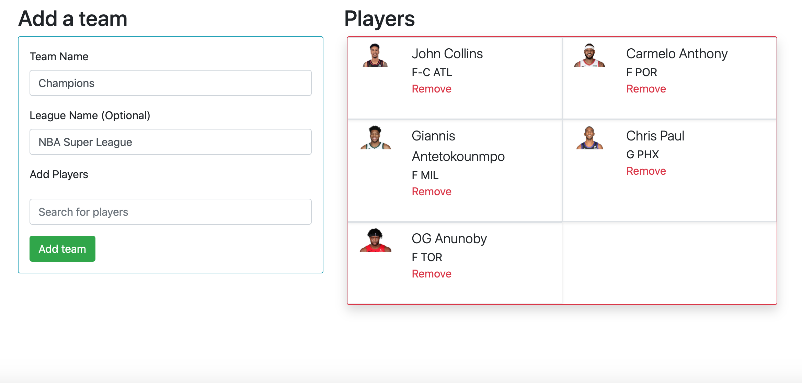
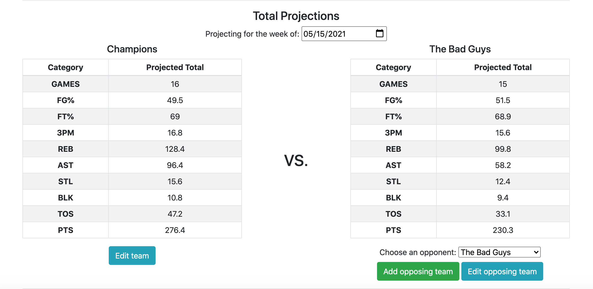
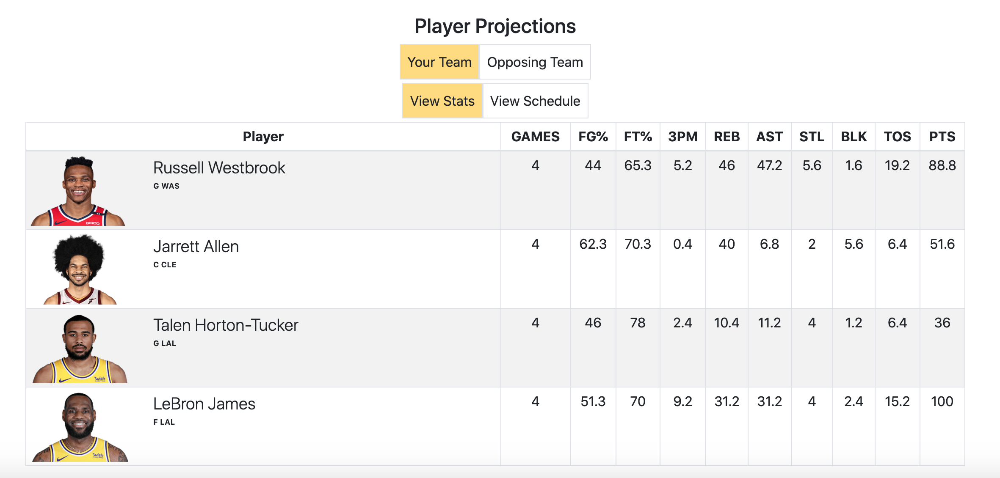
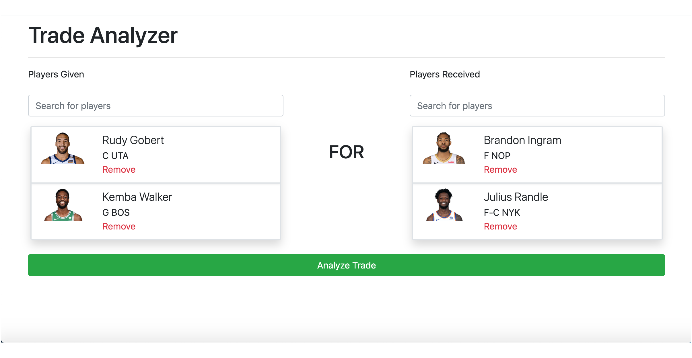
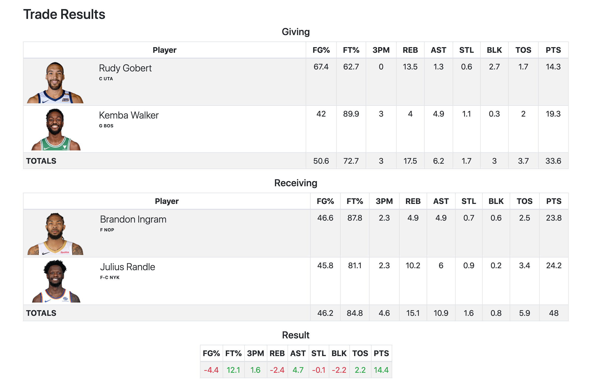
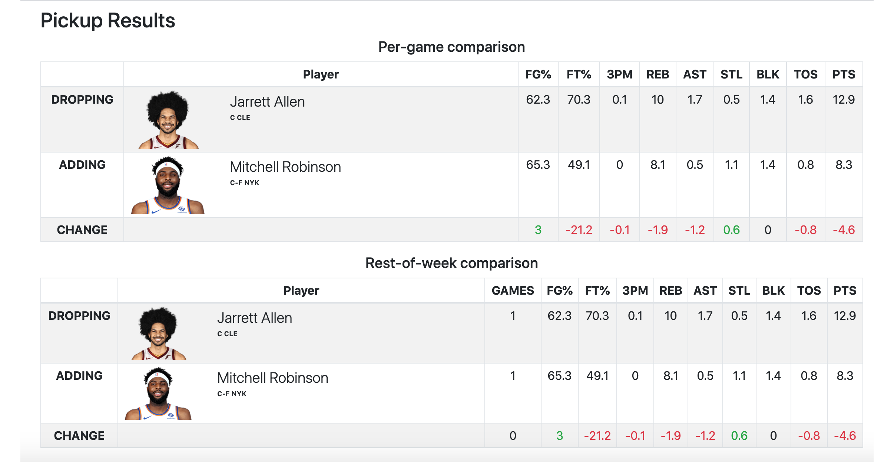
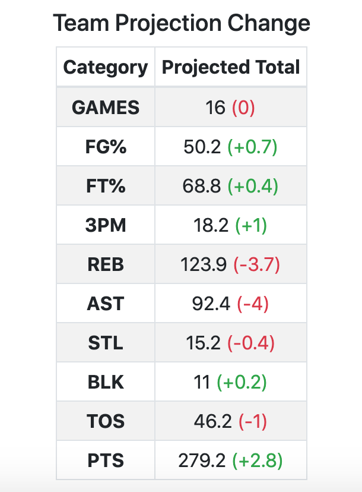

# Fantasy Basketball Assistant
## Table of Contents
- [Summary](#summary)
    - [Production Link](#production-link)
    - [Tech Stack](#tech-stack)
- [Getting Started](#getting-started)
    - [Installation and running locally](#installation-and-running-locally)
    - [Standard User Flow](#standard-user-flow)
- [Key Features](#key-features)
    - [Team Builder](#team-builder)
    - [Team Projections](#team-projections)
    - [Trade Analyzer](#trade-analyzer)
    - [Pickup Analyzer](#pickup-analyzer)
- [Tech Details](#tech-details)
    - [API Information](#api-information)
    - [Testing](#testing)
    - [Standard player data flow](#standard-player-data-flow)
    - [Implementing the Player Search bar](#implementing-the-player-search-bar)


## Summary
This Fantasy Basketball Assistant is designed to help NBA fantasy basketball managers make decisions about their teams. The app pulls game schedule and statistical data from the NBA Data API and makes basic projections of the total production of a set of players for a given week. It also compares stats between players to help managers plan trades and pickups.

This app is designed to be used by players in Head to Head 9-category leagues. Support for Rotisserie or Points leagues is not in development at the moment.

### Production Link
The production version of this app is deployed at [https://fantasy-bball-assistant.herokuapp.com/](https://fantasy-bball-assistant.herokuapp.com/)

### Tech Stack
- Server-side code written in **Python 3.7** using **Flask** backend framework
- **PostgreSQL** database with **Flask-SQLAlchemy**
- **Bootstrap 4.6** for basic front-end layout
- **JQuery** is required for some Bootstrap features, but all other front-end code is written in **Vanilla JavaScript** with **Axios** for HTTP requests.

## Getting Started

### Installation and running locally
1. If you have not already, install Python and PostgreSQL on your machine.
2. Clone this repo onto your local machine.
3. From the command line, in your local directory for this repo, run `$ python -m venv venv`, which should create a virtual environment folder in your directory. Activate this environment by running `$ source venv/bin/activate`.
4. Install all of the required packages by running `$ pip install -r requirements.txt`
5. Create a local version of the database in PostgreSQL.
    - To match the source code without further configuration, from the command line run `createdb fantasy_bball_assistant`. If you will be running the Python unit tests, make sure to also run `createdb fba_test`.
    - If you'd like to use your own database names, make sure to change the default value of `app.config['SQLALCHEMY_DATABASE_URI']` in the following locations:
        - `app.py` on line 20
        - `test_app.py` and `test_models.py` on line 9
6. (Optional) If you'd like to start with a test user and team in the database, from the command line run `$ python run seed.py`. This will create a test user with a username of **testuser** and a password of **testing**.
7. To start the server, run `flask run` from the command line. Open your local host IP in the browser to run your local copy of the app. Make sure PostgreSQL is running.

### Standard User Flow

1. Register for an account. All features of the site require the user to be logged into an account.
2. Create a team. The intention is for the players on your team in this app to match the one you're playing in a real fantasy league with. The tools on this site assist you in managing a real team in a real league by making projections based on the players you have - this app does not host or simulate a fantasy league.
3. From your team's page (accessible from the bar at the top of the screen or from your home page), click "Get Projections" to see your team's total statistical projections for the current week. Choose another date to project for a different week.
4. If you'd like to compare your team against another team, create an opposing team from your team's page or from the team projection page. Once an opposing team is created, you can select that team from the menu on the projection page to compare their stats to your team.
5. Use the Trade Analyzer to compare per-game statstics in all Fantasy Basketball categories between two sets of players. Use this to analyze the potential impact of trading your players for players on another team.
6. Use the Pickup Analyzer to see the potential impact of dropping a player from your team, adding a player to your team, or both. This tool will show per-game stats for the players as well as your team's total stats for the rest of the current week, so that you can assess the impact of picking up a player on the current week of competition.
7. Return to this app throughout the fantasy basketball season in order to get projections against different teams and assess the impact of a pickup or drop on any day/week you'd like. Edit your team and add/edit opponent teams to keep your lineup for matchup projections up-to-date.


## Key Features

### Team Builder


The team builder allows the user to recreate their fantasy team in this app, choosing from all players who have played in the current NBA season based on the NBA API database.

Users enter their team name and optionally enter a league name. Then, they type in player names in the player search bar to find players on their team, and click them to add them. When they are done, they click "Add Team". Their team name is then stored in the database, an association is created between the team and the user, and if the user added players to their team an association is created between the team and every player they chose.

The team builder functionality works the same when the user is building their own team, editing their own team, or creating or editing an opposing team.

#### How it works
1. [Get player data.](#standard-player-data-flow).
2. Create a form for the team name and league name. As part of this form, [implement the player search bar](#implementing-the-player-search-bar).
3. The user can add or remove players from their team until their team matches what they want.
4. When the form is submitted, the team name and league name are stored as an entry in the database. Each player chosen is associated with the team in the database, identified by their API player ID.

### Team Projections

This is the most important feature of the app.

In the head to head format, fantasy basketball matches typically last a week. Over the course of that week, players play a varying number of games depending on the NBA schedule. The winner of the matchup is the manager whose team performs the best over the week in the majority of the 9 categories, based on the games played by the players on the team in that week. The 9 categories are as follows:
- Field Goal Percentage
- Free Throw Percentage
- 3 point shots made
- Total rebounds
- Assists
- Steals
- Blocks
- Turnovers
- Points

This feature makes a simple projection for the player's team performance for a total week based on each player's per-game statistics in each category, multiplied by the number of games they play in that week based on the schedule data we get from the API. It displays the total team stats as well as the stats for all individual players. It also shows the total number of games played by each player and their schedule and opponents for the week.



On page load, this feature makes a projection for the team the user has chosen to get projections for for the current week based on the current date. If the user would like to get projections for a different week, the user can choose a date from the top of the page. This is useful when the user is looking ahead to next week's matchup.

The user can also view projections for an opposing team if they would like to predict how they would fare in a matchup with that team. The user needs to manually build their opponent's team using the team builder (accessible from their team's page), but once they've done that the projection works the same as for their own team. This allows the user to potentially see how they need to adjust their team to win a matchup.

#### How it works
#### Getting a projection for a team:
1. Get each player's per-game statistics and the schedule for their team from the API.
2. Using the schedule data, determine how many games the player is playing in the current week.
3. Multiply the per-game statistics by the number of games to get their total statistics for the week.
4. Repeat for each player and add all statistics into a total. (**Note:** Total FG% and FT% are calculated based on total projected FG and FT makes and attempts for each player, not just on their average season-long percentages from the API. This allows the projections to account for the volume of shots taken by each player. A player shooting 90% but only taking 3 shots per game won't impact your team's FG% much! This tool tries to account for that.)
5. Map the total onto the total statistics table for the team by matching the statistic abbreviation contained in the ID of the cells in the table.
6. Clear the stat and schedule tables for the team on the page (this should be in the HTML). Then, for each player, create a row with their player information in both tables.
7. Fill the schedule table with each player's scheduled games by showing their opponent's team initals on each date if a game is scheduled. If it is an away game, add an @ in front of their opponent's team initials.
8. Get inidividual player totals by calling `getPlayerTotals` for each player on the team, and then map these stats to the player stats table.

#### Flow of the team projection view:
1. [Get player data](#standard-player-data-flow).
2. On page load:
    1. Get the team ID from the URL of the route.
    2. Get the list of player IDs associated with the team ID from the database by calling `getUserTeamPlayerIds`.
    3. Make an array of player data objects from just the user's team IDs.
    4. Get today's date and populate the schedule grid with the dates of the entire current week.
    5. Display projections for the current week for the user's team (following the above process).
3. When the user picks an opposing team:
    1. Get the opposing team ID from the value of the select input for the opponent's team.
    2. Show the opponent team schedule and stat tables, and reveal the switch to toggle to viewing them.
    3. Get the opponent team name and associated player IDs from the database using `getOpponentData`.
    4. Change the team name above the opponent team table to the name of the opponent's team.
    5. Change the link to edit the opposing team to the route for the team ID chosen.
    6. Get player data objects for all players on the oppponent's team.
    7. Display projections for the week of the date in the date input for the user's team (following the above process).
4. When the user changes the date:
    1. Get the date from the date input.
    2. Re-populate the dates in the schedule tables based on the week of the new date input.
    3. Re-run the projections for the user's team. If an opposing team is currently selected, re-run projections for that team as well.
        

#### Future feature ideas/current limitations
- When projecting against an opponent, show which categories the user will win and lose.
- Allow the user to manually adjust the number of games played by each player. This would allow the user to manually account for injured players, or players missing games for other reasons, and get a more accurate total projection. This would also allow the user to manually account for picking up and dropping players mid-week - they could choose not to count any games they know the player won't contribute to their team, and count players they picked up mid-week going forward.
- Add projections for the remainder of the week based on the current date, not just the entire week. The app currently can't calculate how the team has done _so far_ in the week, so in the middle of the week the week-long projections may be inaccurate. Providing a feature to project for the rest of the week would at least allow the user to ignore the total projections in favor of info that may be more relevant for their decision making going forward.
- Allow the user to make projections based on statistics for more recent periods of time than the whole year. For example, the user could have a player on their team who has been hot for the last week but was not playing before that - they may want to get projections based on statistics from the previous 2 weeks, not just the entire year where his averages would be much lower. Currently, I can't get game-by-game statistics from the NBA Data API, and the NBA does not break up it's statistical data by periods of time, so I don't have an easy way of calculating this.

### Trade Analyzer


In fantasy basketball, you can trade players on your team with players on another team if both sides agree to make a trade. That's a big decision to make! So, the trade analyzer tool allows the user to compare the total per-game statistics of two sets of players to see the potential impact of a trade.

The user chooses which players they will give in the trade, and then which players they want to receive. When they click "Analyze Trade", they'll see a statistical comparison.



This feature only compares per-game statistics because a trade is typically a long-term decision. The user will most likely be interested in comparing the total incoming stats to the outgoing stats, but not so much in the impact to their current weekly matchup. So, we display total per-game stats for each side of the trade and show the net difference in statistics between the two sets of players when the stats given are subtracted from the stats received.

#### How it works
1. [Get player data](#standard-player-data-flow).
2. For both sides of the trade, [implement the player search bar](#implementing-the-player-search-bar). There is no form on this page, but the player list for each side of the trade is still created from the hidden multiple-selects in the player search implementation.
3. When the user clicks "Analyze Trade":
    1. Show the trade results tables on the page.
    2. Create an array of HTMLElement `<option>` objects from the `<select>` elements for each side of the trade. The `analyzeTradeSide` function will find which have been selected and include those players in the trade.
    3. For both sides of the trade, pass the array of option elements, today's date, and the array of all player data to `analyzeTradeSide`. For the `target` argument, pass the identifier string used in the HTML, usually 'user' or 'opp'.
    4. The `analyzeTradeSide` function will get and map total stats for each side of the trade using the same process as the team stat projection. However, instead of getting total stats based on a week of games, this function will get each player's stats for one game, meaning we'll just see the total per-game stats for each player.
    5. Map the total stats for each side of the trade underneath the player rows in the tables for the players given and received in the trade using `createTotalStatRow` on each table and calling `mapStatsToTable` on those total cells.
    6. Finally, use `getComparison` to get an object containing the differences between each set of stats after subtracting the stats of the players given from the stats of the players received. Map those differences to the trade results table, displaying the positive changes in green text and the negative changes in red.

#### Future feature ideas/current limitations
- If the user wants to only select from players on their team and/or their opponents that they've already stored in the database, it should be easier to do so. I could add a selection input for players given that only picks players from the team the user chooses, and then populate a list of oppposing teams for that team and create a select input for the players on those teams as well. This would allow the user to more easily adjust their trades based on the real teams in their league.

### Pickup Analyzer


In Fantasy Basketball, you are always able to drop players on your team and pick up players from the "waiver wire", which is the list of all NBA players that are not currently on a fantasy team in your league. This allows you to adjust your team in a few ways, like replacing underperforming players, or getting a player who produces different statistics than a player you have so that you can win a different category. Some players even use a tactic called "streaming" to pick up a new player every day who will be playing on that day of the NBA schedule and dropping a player who isn't playing, allowing them to maximize the number of games their players are playing over the course of the week. Usually, there is a set number of pickups that a manager is allowed to make in a week.

All of that is considered in the Pickup Analyzer, which attempts to show you the impact on a team and a weekly matchup when you pick up a player, drop a player, or both.

First, the user can choose a player to drop from one of their own teams. It made sense to me to restrict this selection to players actually associated with the user's teams, because there's less useful information to be gained when considering a player's stats who may or may not be part of a team.

Then, the user can choose a player to add from any player. The app cannot know which players are on the user's "waiver wire", so I couldn't restrict that choice in any meaningful way, but again this tool is not especially useful if the user is analyzing a pickup of a player they can't get so it shouldn't really matter. So, the user can pick any player from the API data to pick up.

Both choices are restricted to only one player, as opposed to multiple like the Trade Analyzer. These transactions are always one-off in the context of a real fantasy league. If the user already has a full roster, they need to drop a player to pick one up, so picking up and dropping a player at the same time is extremely common.

The analysis shows a per-game comparison, rest-of-week comparison, and weekly team projection. 
- The per-game comparison simply shows the per-game statistics for each player and shows a comparison if the user is picking up and dropping a player. 
- The rest-of-week comparison uses the current date and the schedule data to determine each player's projected total statistics for the rest of the current week. This works similar to the team projection by multiplying each player's per-game average statistics by the number of games they play after the current date. Again, if a player is being picked up and another is being dropped, we show a comparison.
- If the user has chosen one of their teams in the input, then we show a weekly team projection based on the user's entire team for the rest of the week if they were to make the transaction. A number is appended to the table to show the difference between the user's current team and their team after the transaction.



#### How it works
1. [Get player data](#standard-player-data-flow).
2. The dropped player selection requires two pieces:
    1. On page load, one select element should have option elements with values representing the IDs for each team belonging to the user. The player select should be empty.
    2. When the user selects one of their teams, call `getUserTeamPlayerIds` to get the player IDs associated with that team from the database. Then, fill the player select with option elements representing each player. When an option is selected from this select, show the player info on-screen.
3. The player pickup selection uses the `singleChoicePlayerSearch` class to allow the user to search and select players in a search bar. [See implementation details here.](#implementing-the-player-search-bar)
4. When the user clicks "Analyze Pickup":
    1. Reveal the per-game and rest-of-week comparison tables.
    2. If the user chose a player to drop:
        1. Get player info for the chosen player and call `analyzePickupSide`, which does the following:
        2. Populate player info for both comparison tables.
        3. Get the per-game stats for the player by calling `getPlayerTotals` wwith a `numGames` value of 1.
        4. Then, get the number of games the player is playing in the rest of the week by passing the current date and the player to `getNumWeekGamesRemaining`. This function looks at the schedule for the current week and determines which games occur after today's date. 
        5. Get the player's total projected stats for the rest of the week by calling `getPlayerTotals` with the `numGames` value set to the value returned by `getNumWeekGamesRemaining`.
        6. Map both sets of stats to the tables. Cache the per-game stats and rest-of-week stat totals returned by `analyzePickupSide` for use later.
    3. If the user chose a player to pick up:
        1. Same process as above, but with the added player.
    4. If the user picked both:
        1. Create a row in the per-game table to show the difference between the two sets of per-game stats.
        2. Use `getComparison` to calculate the dropped player's stats subtracted from the added player's stats.
        3. Map the stat differences to the table.
        4. Repeat for the rest-of-week stats and table.
    5. If the user selected a team:
        1. Show the total team projection table.
        2. Get the player IDs associated with the team from the database using `getUserTeamPlayerIds` and make an array of player data.
        3. Pass this list and today's date to `getTeamTotals` to get the total weekly stat projection for this week for the team as it stands now. Cache this as `currentTeamTotals`.
        4. Get the difference between the weekly stats, subtracting the dropped player from the picked up player. Add this difference to the total stats using `addStats` and cache as `newTeamTotals`.
        5. Set the `fgp` and `ftp` properties of `newTeamTotals` to be the percentage of free throws and field goals made TOTAL, instead of the difference we got back from `addStats`. This allows us to account for the realistic difference in shooting percentages the user will experience based on the volume of shots the players in the transaction take. The raw values returned from `addStats` will not make sense.
        5. In the totals table, map the `newTeamTotals`.
        6. Use `addDiffToTable` to append the difference between `currentTeamTotals` and `newTeamTotals` to the table cells. Show a positive change in green, and a negative change in red.
    
#### Future feature ideas/current limitations
- It would possibly be helpful to allow the user to project the rest of the week from any given date, not just today's date.
- In some distant future where I can read data from the user's league, having a realistic waiver wire list for the user to choose from would be great.
- I'm not sure if this is the tool where it should be included, but having some way to identify hot pickups for the user based on statistics would be very helpful.

## Tech Details

### API Information
I am using the NBA Data API for player stats and NBA schedule data. Documentation on how to use this API can be found [here](https://github.com/kashav/nba.js/blob/master/docs/api/DATA.md).

The front-end of this app also makes HTTPS calls to the server to get database information about teams and players, returned as JSON.
1. The `/data/teams/<team_id>/players` route returns JSON containing array `players`, which contains the NBA API player IDs for all players on the team in the database with the primary key passed in the route.
2. The `/data/oppteams/<int:opp_team_id>` route returns JSON with properties `name` and `players`, containing the string name and array of player IDs associated with the opponent team in the database with the primary key passed with the route.

### Testing
**Python**

Tests are located in the `test_app.py` and `test_models.py` files in the root directory.

`test_app.py` is a set of integration tests to test the Flask routes in `app.py`.

`test_models.py` is mostly a set of unit tests to test the class methods attached to the SQLAlchemy models in `models.py`. There are some integration tests to test the interaction with the database.

To run all tests, run the following from the command line in the root directory:

    $ python -m unittest

Add the name of the file at the end of the command to test only one file.

**JavaScript non-HTTP tests**

This repo uses Jasmine unit tests to test as many JS functions as possible.

Unit tests for all of the functions that are not dependent on HTTP requests live in the following files in the static directory:

| Function file | Test file |
| ----------- | ----------- |
| stats.js      | test-stats.js       |
| players.js   | test-players.js        |
| schedule.js | test-schedule.js |
| playersearch.js | test-playersearch.js |
| utilities.js | test-utilities.js |

Some of the functions tested in these files do typically use HTTP data to run. These functions have been rewritten to use test data just for these Jasmine tests. The testing data is located in `testdata.js`, and the functions rewritten to use it are located in `mock-functions.js`. 

When testing any of these files on an HTML page, `mock-functions.js` needs to be linked as a script _underneath_ the regular function files, and the test files need to be linked as a script underneath that as well as `testdata.js`. This will ensure that when the tests are run, the versions defined in `mock-functions.js` will be used since they are defined _after_ the functions in the original files.

**To run these tests**, just open `test-results.html` in the static directory via the file protocol in your browser. The Jasmine CSS and HTML should show the results of the tests in all 5 files. The HTML in this file should have mock versions of all of the HTML elements needed for the functions to pass the tests and operate as they would in the app.

**JavaScript HTTP tests**

In order to test `api.js`, we need to be running the Flask server locally to access the routes that require the database. These tests are located in `test-api.js` and are run in the `test-api-results.html` file in the templates directory. Here's how to run the tests:

1. From the command line in the root directory, run `flask run`.
2. Open the local version of the app at the IP address Flask provides in the terminal.
3. Register, or log in as, a user with the username `admin`. This user is not accessible on the production version of the app, but can be created locally in your version of the database.
4. Go to the `/test-api` route. This should show the test results in the Jasmine HTML and Javascript.

### Standard player data flow
On all views requiring player data, the same three steps are executed on page load:

1. `getAllPlayers()` is called asynchronously to  get data for all NBA players from the current season from the NBA data API.
2. `getAllTeams()` is called asynchronously to get data for all NBA teams from the NBA data API.
3. After both have been loaded, we create an array of player data objects, usually stored as a constant `players`, by calling `getPlayers` with the player and team data we just received passed as argument. This function does two things for each player object:
    1. Extract the relevant bits of data for the app from the getAllPlayers API data. This includes name, player ID (for the API), team ID, and position.
    2. Using the team ID, associate the player with a team from the getAllTeams API data. Then fill in the team initials in the player object so that we can display the team initials when we show player info.

Throughout the rest of this document, this process will just be referred to as "getting player data". Most other functions of the app require this process.

### Implementing the Player Search bar
The `playerSearch` class takes player data and a set of HTML elements and creates a search bar that autocompletes with real player names based on what the user has typed. The user clicks a name from the suggestions underneath the bar to select players for whatever feature they are using. Clicking a name selects an option from a hidden `<select>` element, which is used to send player ID lists to the database or create lists of players for analysis. It then displays that player's info on-screen including info about that player. Players that have already been selected are not included in the list of results. To remove a player from the list of selections, the user clicks the "Remove" button next to the player's info.

This implementation is used in the Team Builder, Trade Analyzer, and Pickup Analyzer.

Here are the parameters for the search class:
```
/**
* @param {HTMLElement} searchBar A text input element. This is where the user types their search terms.
* @param {HTMLElement} results A div element that lives underneath the search bar. When the user focuses on the search bar, this element appears. The playerList is a child of this element.
* @param {HTMLElement} playerList A ul element that is a child of the results div. This is where the list of matching player names is populated.
* @param {HTMLElement} container A div that contains the searchBar, results, and playerList elements.
* @param {Object[]} players An array of all player data objects that comes from getPlayers.
* @param {HTMLELement} targetList A div that will contain the info of the players selected from this bar. Populated by "player blocks", divs containing the player's name, position, team, and picture.
* @param {Number} targetColumns The number of bootstrap columns that the div for the selected player's info should fill. Use 6 for two-column targetLists, and 12 for a single-column list.
* @param {HTMLELement} playerSelect The hidden <select> element where the selected players are tracked.
*/
```

Here is some example HTML setting up this implementation:
```
<div class="form-group">
    <label for="players">Add Players</label>
    <select class="form-control" id="players" name="players" multiple hidden>
    </select>
</div>
<!-- Add player search to replace multi-select input -->
<div class="my-3" id="player-search">
    <input class="form-control" type="text" id="player-search-bar" placeholder="Search for players">
    <div class="search-results shadow rounded-sm hide" id="player-search-results">
        <ul id="player-list"></ul>
    </div>
</div>
```

And lastly, here's how this HTML is converted into a playerSelect in the JavaScript file for the team builder view:
```
const players = getPlayers(playerData, teamData);

const searchBar = document.querySelector('#player-search-bar');
const results = document.querySelector('#player-search-results');
const playerList = document.querySelector('#player-list');
const searchContainer = document.querySelector('#player-search');
const targetList = document.querySelector('#team-builder-list');
const playerSelect = document.querySelector('#players');

const search = new playerSearch(searchBar, results, playerList, searchContainer, players, targetList, 6, playerSelect);
```

There is also the `singleChoicePlayerSearch` class, which is used on the Pickup Analyzer to let the user choose just one player at a time instead of multiple. Here are the differences in this class:
- `targetColumns` is not needed as a parameter because we'll always just use 12 for a single column.
- When a player is selected, the existing selection is cleared from the Set of selected players.
- The `playerSelect` element used here should be a standard select element, not a multiple-select.


