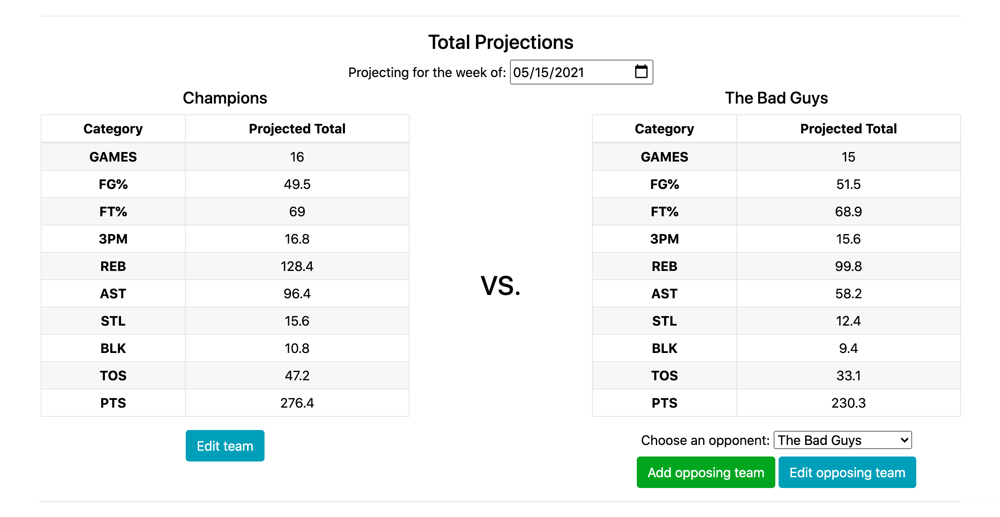

# Fantasy Basketball Assistant
## Table of Contents
- [Summary](#summary)
    - [Production Link](#production-link)
    - [Tech Stack](#tech-stack)
- [Getting Started](#getting-started)
    - [Installation and running locally](#installation-and-running-locally)
    - [Standard User Flow](#standard-user-flow)
- [Key Features](#key-features)
    - [Team Builder](#team-builder)
    - [Team Projections](#team-projections)
    - [Trade Analyzer](#trade-analyzer)
    - [Pickup Analyzer](#pickup-analyzer)
- [Tech Details](#tech-details)
    - [API Information](#api-information)
    - [Testing](#testing)
    - [Standard player data flow](#standard-player-data-flow)
    - [Implementing the Player Search bar](#implementing-the-player-search-bar)

## Summary
This Fantasy Basketball Assistant is designed to help NBA fantasy basketball managers make decisions about their teams. The app pulls game schedule and statistical data from the NBA Data API and makes basic projections of the total production of a set of players for a given week. It also compares stats between players to help managers plan trades and pickups.

This app is designed to be used by players in Head to Head 9-category leagues. Support for Rotisserie or Points leagues is not in development at the moment.

### Production Link
The production version of this app is deployed at [https://fantasy-bball-assistant.herokuapp.com/](https://fantasy-bball-assistant.herokuapp.com/)

### Tech Stack
- Server-side code written in **Python 3.7** using **Flask** backend framework
- **PostgreSQL** database with **Flask-SQLAlchemy**
- **Bootstrap 4.6** for basic front-end layout
- **JQuery** is required for some Bootstrap features, but all other front-end code is written in **Vanilla JavaScript** with **Axios** for HTTP requests.

## Getting Started

### Installation and running locally
1. If you have not already, install Python and PostgreSQL on your machine.
2. Clone this repo onto your local machine.
3. From the command line, in your local directory for this repo, run `$ python -m venv venv`, which should create a virtual environment folder in your directory. Activate this environment by running `$ source venv/bin/activate`.
4. Install all of the required packages by running `$ pip install -r requirements.txt`
5. Create a local version of the database in PostgreSQL.
    - To match the source code without further configuration, from the command line run `createdb fantasy_bball_assistant`. If you will be running the Python unit tests, make sure to also run `createdb fba_test`.
    - If you'd like to use your own database names, make sure to change the default value of `app.config['SQLALCHEMY_DATABASE_URI']` in the following locations:
        - `app.py` on line 20
        - `test_app.py` and `test_models.py` on line 9
6. (Optional) If you'd like to start with a test user and team in the database, from the command line run `$ python run seed.py`. This will create a test user with a username of **testuser** and a password of **testing**.
7. To start the server, run `flask run` from the command line. Open your local host IP in the browser to run your local copy of the app. Make sure PostgreSQL is running.

### Standard User Flow

1. Register for an account. All features of the site require the user to be logged into an account.
2. Create a team. The intention is for the players on your team in this app to match the one you're playing in a real fantasy league with. The tools on this site assist you in managing a real team in a real league by making projections based on the players you have - this app does not host or simulate a fantasy league.
3. From your team's page (accessible from the bar at the top of the screen or from your home page), click "Get Projections" to see your team's total statistical projections for the current week. Choose another date to project for a different week.
4. If you'd like to compare your team against another team, create an opposing team from your team's page or from the team projection page. Once an opposing team is created, you can select that team from the menu on the projection page to compare their stats to your team.
5. Use the Trade Analyzer to compare per-game statstics in all Fantasy Basketball categories between two sets of players. Use this to analyze the potential impact of trading your players for players on another team.
6. Use the Pickup Analyzer to see the potential impact of dropping a player from your team, adding a player to your team, or both. This tool will show per-game stats for the players as well as your team's total stats for the rest of the current week, so that you can assess the impact of picking up a player on the current week of competition.
7. Return to this app throughout the fantasy basketball season in order to get projections against different teams and assess the impact of a pickup or drop on any day/week you'd like. Edit your team and add/edit opponent teams to keep your lineup for matchup projections up-to-date.

## Key Features

### Team Builder

The team builder allows the user to recreate their fantasy team in this app, choosing from all players who have played in the current NBA season based on the NBA API database.

Users enter their team name and optionally enter a league name. Then, they type in player names in the player search bar to find players on their team, and click them to add them. When they are done, they click "Add Team". Their team name is then stored in the database, an association is created between the team and the user, and if the user added players to their team an association is created between the team and every player they chose.

The team builder functionality works the same when the user is building their own team, editing their own team, or creating or editing an opposing team.

#### How it works
1. [Get player data.](#standard-player-data-flow).
2. Create a form for the team name and league name. As part of this form, [implement the player search bar](#implementing-the-player-search-bar).
3. The user can add or remove players from their team until their team matches what they want.
4. When the form is submitted, the team name and league name are stored as an entry in the database. Each player chosen is associated with the team in the database, identified by their API player ID.

### Team Projections

This is the most important feature of the app.

In the head to head format, fantasy basketball matches typically last a week. Over the course of that week, players play a varying number of games depending on the NBA schedule. The winner of the matchup is the manager whose team performs the best over the week in the majority of the 9 categories, based on the games played by the players on the team in that week. The 9 categories are as follows:
- Field Goal Percentage
- Free Throw Percentage
- 3 point shots made
- Total rebounds
- Assists
- Steals
- Blocks
- Turnovers
- Points

This feature makes a simple projection for the player's team performance for a total week based on each player's per-game statistics in each category, multiplied by the number of games they play in that week based on the schedule data we get from the API. It displays the total team stats as well as the stats for all individual players. It also shows the total number of games played by each player and their schedule and opponents for the week.

On page load, this feature makes a projection for the team the user has chosen to get projections for for the current week based on the current date. If the user would like to get projections for a different week, the user can choose a date from the top of the page. This is useful when the user is looking ahead to next week's matchup.

The user can also get projections for an opposing team if they would like to predict how they would fare in a matchup with that team. The user needs to manually build their opponent's team, but once they've done that the projection works the same as for their own team. This allows the user to potentially see how they need to adjust their team to win a matchup.

#### How it works
Getting a projection for a team:
1. Get each player's per-game statistics and the schedule for their team from the API.
2. Using the schedule data, determine how many games the player is playing in the current week.
3. Multiply the per-game statistics by the number of games to get their total statistics for the week.
4. Repeat for each player and add all statistics into a total.
5. Map the total onto the total statistics table for the team by matching the statistic abbreviation contained in the ID of the cells in the table.
6. Clear the stat and schedule tables for the team on the page (this should be in the HTML). Then, for each player, create a row with their player information in both tables.
7. Fill the schedule table with each player's scheduled games by showing their opponent's team initals on each date if a game is scheduled. If it is an away game, add an @ in front of their opponent's team initials.
8. Get inidividual player totals by calling `getPlayerTotals` for each player on the team, and then map these stats to the player stats table.

Flow of the team projection view:
1. [Get player data](#standard-player-data-flow).
2. On page load:
    1. Get the team ID from the URL of the route.
    2. Get the list of player IDs associated with the team ID from the database by calling `getUserTeamPlayerIds`.
    3. Make an array of player data objects from just the user's team IDs.
    4. Get today's date and populate the schedule grid with the dates of the entire current week.
    5. Display projections for the current week for the user's team (following the above process).
3. When the user picks an opposing team:
    1. Get the opposing team ID from the value of the select input for the opponent's team.
    2. Show the opponent team schedule and stat tables, and reveal the switch to toggle to viewing them.
    3. Get the opponent team name and associated player IDs from the database using `getOpponentData`.
    4. Change the team name above the opponent team table to the name of the opponent's team.
    5. Change the link to edit the opposing team to the route for the team ID chosen.
    6. Get player data objects for all players on the oppponent's team.
    7. Display projections for the week of the date in the date input for the user's team (following the above process).
4. When the user changes the date:
    1. Get the date from the date input.
    2. 
        

#### Future feature ideas/current limitations
- When projecting against an opponent, show which categories the user will win and lose.
- Allow the user to manually adjust the number of games played by each player. This would allow the user to manually account for injured players, or players missing games for other reasons, and get a more accurate total projection. This would also allow the user to manually account for picking up and dropping players mid-week - they could choose not to count any games they know the player won't contribute to their team, and count players they picked up mid-week going forward.
- Add projections for the remainder of the week based on the current date, not just the entire week. The app currently can't calculate how the team has done _so far_ in the week, so in the middle of the week the week-long projections may be inaccurate. Providing a feature to project for the rest of the week would at least allow the user to ignore the total projections in favor of info that may be more relevant for their decision making going forward.
- Allow the user to make projections based on statistics for more recent periods of time than the whole year. For example, the user could have a player on their team who has been hot for the last week but was not playing before that - they may want to get projections based on statistics from the previous 2 weeks, not just the entire year where his averages would be much lower. Currently, I can't get game-by-game statistics from the NBA Data API, and the NBA does not break up it's statistical data by periods of time, so I don't have an easy way of calculating this.

### Trade Analyzer
### Pickup Analyzer

## Tech Details

### API Information
I am using the NBA Data API for player stats and NBA schedule data. Documentation on how to use this API can be found [here](https://github.com/kashav/nba.js/blob/master/docs/api/DATA.md).

The front-end of this app also makes HTTPS calls to the server to get database information about teams and players returned as JSON.
1. The `/data/teams/<team_id>/players` route returns JSON containing array `players`, which contains the NBA API player IDs for all players on the team in the database with the primary key passed in the route.
2. The `/data/oppteams/<int:opp_team_id>` route returns JSON with properties `name` and `players`, containing the string name and array of player IDs associated with the opponent team in the database with the primary key passed with the route.

### Testing

### Standard player data flow
On all views requiring player data, the same three steps are executed on page load:

1. `getAllPlayers()` is called asynchronously to  get data for all NBA players from the current season from the NBA data API.
2. `getAllTeams()` is called asynchronously to get data for all NBA teams from the NBA data API.
3. After both have been loaded, we create an array of player data objects, usually stored as a constant `players`, by calling `getPlayers` with the player and team data we just received passed as argument. This function does two things for each player object:
    1. Extract the relevant bits of data for the app from the getAllPlayers API data. This includes name, player ID (for the API), team ID, and position.
    2. Using the team ID, associate the player with a team from the getAllTeams API data. Then fill in the team initials in the player object so that we can display the team initials when we show player info.

Throughout the rest of this document, this process will just be referred to as "getting player data". Most other functions of the app require this process.

### Implementing the Player Search bar

