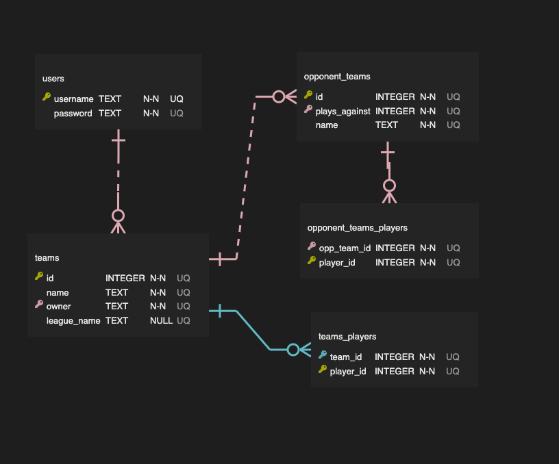

# Capstone Proposal
## Fantasy Basketball Assistant
 

### Goal
The goal of this fantasy basketball assistant app is to provide tools that help fantasy basketball managers project the outcomes of their decisions to add or remove players from their team. Typical fantasy basketball management apps like ESPN or Yahoo provide the user with an interface to manage which players are on their team, look at league info, and look at statistics for players, but don't have analysis and projection tools. My app will allow the user to input which players they have on their team currently, and use player statistical data to help the user predict how their team will perform and how adding or trading players will impact their stats.

### Users
This app will be for people who are actively managing a fantasy basketball team. Specifically, it will be useful for anyone who wants to use a tool to do deeper research and analysis to improve their team(s).

### Data Needed
To make this app, I primarily need two sources of data - first, the NBA schedule, and second, player information and statistics.  
The schedule is important because fantasy basketball matchups last a week, and teams don't all play the same number of games in a week. So in order to be able to project how a user's team will perform in a week without the user manually entering how many games that player is going to play, I will need to know how many games their team is playing within a date range.  
For player information, I primarily need to have player names and the NBA team that they play for. I will need to be able to associate a player with a team to know when they are playing.  
Finally, the key piece here is player statistics. There are 9 categories that players compete to win in a traditional head-to-head fantasy league:
- Field Goal %
- Free Throw %
- 3pt shots made
- Rebounds
- Assists
- Steals
- Blocks
- Turnovers
- Points  

These are common NBA player statistics and should be available in any data source for current statistics. Ideally, instead of just percentages, I'll be able to get the number of average attempts and makes for field goals and free throws so I can give a more accurate week-long projection.  
There is some level of granularity that will allow me to be more detailed in my projections. At a base level, I just need to know what a player is averaging per-game in each category, preferably up-to-date to the last game played. A step further would be being able to get the stats for each player's individual games, since this would allow me to show how a player has performed recently. It's common in Fantasy basketball to look at stats from the previous 7 days, 15 days, or 30 days. With individual game logs linked to the schedule, I would be able to derive the players' average stats over specific periods of time.  
As of right now, this is the API I believe I'll be using: https://www.balldontlie.io/#introduction
  
### Approach
#### **Database Schema**
  
Notes:  
- All information about NBA teams, schedules, and player statistics will be coming from the API, so I don't need to store any of that data in my database. Player IDs in the teams_players tables will refer to the player's ID in the API (or some other identifier depending on what is the most reliable way to get player data.)
- I'm hoping to allow the user to save data on their opponent's teams so they can quickly compare how they'll perform when they play against them. This is what I'm tracking in the opponent_teams table. These teams will have a one to many relationship with the user's own teams, since the user most likely has multiple opponents, but those opponents only play against one of the user's teams.
- The teams_players and opponent_teams_players tables will use the combination of the team ID and the player ID as the primary key. This makes the most sense to me because the same player ID will be able to be on multiple teams, but one player can't be on the same team twice.
- There are multiple types of fantasy leagues with different scoring systems, but currently I think the scope of this app is to only help with 9-category head-to-head leagues, a very popular format. If I do expand the app to handle multiple rulesets then I would probably need the teams table to have a column tracking which ruleset that team plays in.  

#### **Possible API Issues**
- Depending on the format of the statistical data available, I might have to do my own math to get some of the stats I want to display. A player's season stats could come in as averages or totals, or even only as individual game logs where I'd need to add up or average the stats myself.
- I'm hoping the API I use will make it easy to connect a player to a team, a team to a game, and a game to a date, via IDs or easy to use keys. Those are the connections that are going to be key to displaying projections.
- Hopefully the game data in the API will make it clear which season the games occurred in, otherwise I may need to set my own dates to make sure I'm only showing data for the current season.
- Ideally it will be easy to get stats for individual games for a player. If not, my app will not be able to show statistics for specific periods of time, just for the full season to this point.
- The API will need to have consistent IDs for players so that I can store those IDs in my database to associate with a user's teams. If those IDs were to change at any time then a user's team data would need to e rebuilt.

#### **Security**
I really only need to save the user's password here. There's nothing sensitive about fantasy basketball stats, although some uptight managers might disagree with me.

#### **Functionality**
1. Users can build and save a representation of their fantasy team(s) by finding the names of their players and adding them to a saved team.
    - Users need to name their team, and can enter the name of the league they play in if they'd like.
2. Users will be able to project their team's total statistics in the 9 standard categories for a given week based on each player's average  per-game statistics in each category and the number of games they play in the week. This will show projections for any full week in the future as well as the rest of the current week - it's not expected that the user will keep their team totally accurate every day in my tool, so showing the rest-of-week projection will be more useful than projecting backwards.
3. Users can build representations of their opponent's teams that will be playing against one of their teams. There will be a projection view that allows the user to see how their own team will fare against an opposing team.
4. There will be a Trade Analyzer tool that will allow the user to see how two players compare against eachother in each stat to see how a trade might change the performance of the user's team. This tool will display on just per-game statistical differences between the players, since trades are usually a long-term decision and the impact on the weekly matchup doesn't need to be considered.
5. The other key tool will be a "pickup analyzer". In fantasy basketball, you can pick up and drop players at any given time - many players do this every day to maximize the total number of games played by their players in a week. This is a more short-term decision in most cases, so this tool should show how that decision will impact the rest of the team's week - how many more games each player is going to play, and the difference in the user's projected outcome after they add the player.
6. Lastly, users will be able to view individual player stats on my site. At minimum, users can find a player by name and open a page with their current-season stats. This page should also have buttons to allow the user to quickly jump to the trade or pickup analyzer to see how adding that player to one of the user's teams could impact their stats. 
    - Ideally, depending on the kind of data I can get from the API, users can also view all players and their stats in a sortable table so that they can find players who fit the stats they're looking for. This may be difficult depending on the format of the data returned from the API.

#### **User Flows**
1. When the user arrives at the home page, they will be prompted to register or log in. No other page will be visible without being logged in.
2. After the user registers, they will be prompted to build and save their first team. This is technically optional, and the user will be able to navigate to other tools immediately if they'd like to, but those tools become more fully-featured with a saved team so we want to encourage it! Users will choose players from a list and add and delete players until their team matches their fantasy team.
3. Once they've built a team, they'll be brought to a user dashboard that shows them the name of their team(s). From here, the user can navigate to create more teams, edit their existing teams, go to the projection, trade, or pickup tools, or find players.
4. **Projection view**
    1. The user will pick which team they want to see projections for from a list of their own teams. There will be an button to go to the view to add a new team.
    2. The first projection that appears after a user picks their team will be for the rest of the current week. This view will show projections for all 9 statistical categories. Users can pick another week from a menu if they want to project a future week, or toggle to see a projection for the full current week instead of just the rest of the week.
    3. From a separate menu, users can choose one of their opponent's teams that is associated with the team they're viewing. Choosing one will add a comparison view to the page between the two teams. There will also be an option to add a new opposing team.
5. **Trade analyzer**
    1. This view will show two columns, one labeled "your players" and one labeled "their players". At the top of each column will be a search bar to find players by name. The user will also have the option to choose one of their own teams from a menu - if they do, the search bar for "drop" instead becomes a list of the players on that team.
    2. Users will use the search to add and remove players to each side until they've created the full trade they want to analyze, with all of the players they're giving and they're receiving. There shouldn't need to be a maximum number of players that can be added to either side.
    3. Then, the user will click "analyze trade", which will show a comparison between the per-game stats of all players involved in the trade on each side. This view should also show the net difference in stats so the user can see which stats they would be gaining and/or losing.
6. **Pickup analyzer**
    1. This view will show two columns, one labeled "add" and one labeled "drop". At the top of each column will be a search bar to find players by name. The user will also have the option to choose one of their own teams from a menu - if they do, the search bar for "drop" instead becomes a list of the players on that team. There will only be one player in each column at a time.
    2. Once a player has been added to the "add" column, the user can click "analyze". It is not always required for a fantasy basketball manager to drop a player when picking one up.
    3. When "analyze" is clicked, the user will see what per-game stats they'll gain for the added player and how many games they're going to play for the rest of the current week. If a player is in the "drop" column, they'll also see the per-game stats and games remaining for that player, as well as a direct comparison between the two. Lastly, if the user chose one of their own teams, they'll see how their projections for the rest of the week change based on the transaction.
7. **Player view**
    1. Lastly, users can view a player's page by searching for them by name or clicking on them from any of the other views. This page will just show the player's per-game average stats at minimum. If I have the data, I'll also show some of their individual game statistics.
    2. From this page, the user can click buttons to jump to a trade analysis or pickup analysis involving that player.

#### **What makes this more than CRUD?**
The projection calculations are what make this go beyond CRUD. The team-building is the CRUD aspect of the project. Everything else on top of that is not!

#### **Stretch Goals**
- As mentioned earlier, if I can create a table of active players where users can sort by stats, that would be a cool addition. That is pretty standard on most sports-statistic sites, I'm just not sure if getting this data from an API will make it easy for me to do that. Taking it a step further, fantasy sports sites often allow you to filter a list of players by specific statistics, teams, or schedules. All of those would be stretch goals within this stretch goal.
- Fantasy basketball "ratings" are usually calculated by finding the standard deviation of the player's average stats from the stats of all other active players. This is a pretty complex calculation and I'm not sure how well I'll be able to organize the API data and get this number without storing the player stats in my own database or making some big API calls constantly. Once I start working with the data I'll see how possible this would be to include. If it seems doable, it would be a pretty valuable addition to the pickup and trade analysis tools as well as the player statistic pages.
- A big part of fantasy basketball is finding lesser-known players who are performing well that you might be able to pick up. A friend of mine requested that I try to find a way to identify players who are trending upwards. I think I might need to use the ratings in the previous bullet point to find players performing "well" overall, and then compare those ratings over time to find players who are trending up. That's a lot of calculations! Not sure if that's something I'll be able to include in the first version of this.
- Expanding ruleset options - winning a matchup in 8-category or "points"-based leagues is a different set of criteria, so my app wouldn't be too helpful for players who play in different ways. Adding 8-category projections wouldn't be that difficult to add. Points calculations would be much harder. Also, not all leagues even use the same statistics. Depending on which statistical data comes from my API, it might actually be pretty easy to allow the user to add and remove statistics from their projections.
